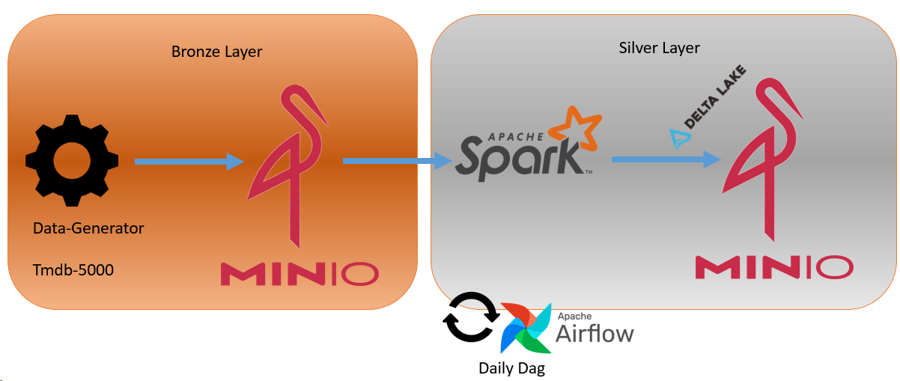
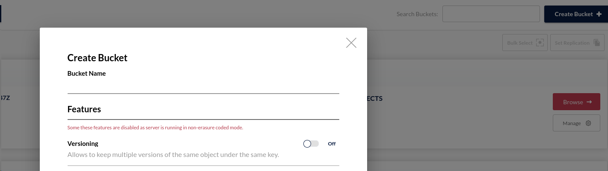
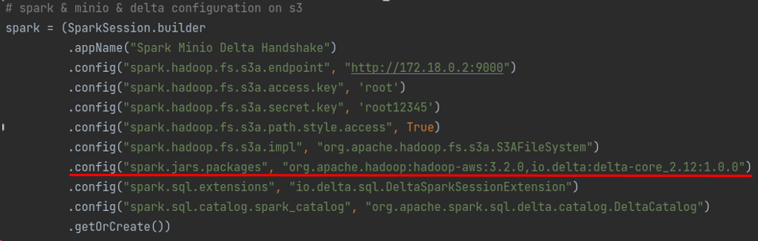
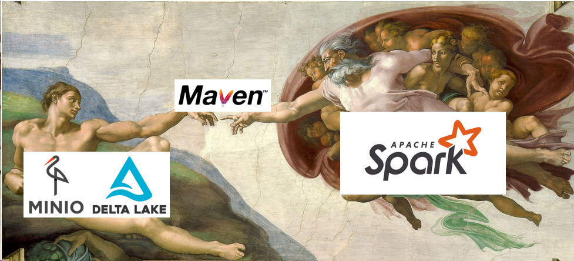

# Object Storage Delta Table Operation

## Overview

The purpose of this repo is to transform data previously ingested from a source into a raw object storage (Minio) bucket 
and then load the transformed data in Delta tables format into a Silver bucket in the same object storage.
During the transformation process, the columns in raw data have Json format has been mined and processed 
by Spark functions and schemed in order to reach verified data tables which can be easily used for data analyses.
In order to automate these progress daily has designed an Airflow Dag.


# Keywords

* Object Storage (Minio)
* Using Minio with S3 configs in Spark
* Spark handshaking with Minio and Deltalake at once
* Apache Spark, Pyspark
* BOTO3
* Nested JSON column converting to normalized data-columns by Spark
* Deltalake, merging delta tables in a object storage bucket
* Flatten files, Flatten Delta Tables
* Airflow, DAG

## Required Services

* Docker
* MinIO
* Apache Spark
* Deltalake
* Apache Airflow

---

* Centos 7
* IDE : Pycharm


## Datasource

https://www.kaggle.com/datasets/tmdb/tmdb-movie-metadata?select=tmdb_5000_movies.csv

## Steps

1. Ingesting data as simulation in MinIO Bronze Bucket.
2. Reading data from bronze bucket with Spark and transform to the delta tables.
3. Merging deltas under the silver bucket of MinIO
4. Automation of this pipeline daily with Airflow



### Required services up!

* Firstly Docker & Airflow should start. Then docker-compose.yaml file should be up in order to run minio.

from terminal:

`sudo systemctl start docker`
`cd /<location_of_docker_compose.yaml>/ && docker-compose up -d `
`docker start minio`
`sudo systemctl start airflow`
`sudo systemctl start airflow-sheduler`

### Download data:

`wget -O /<location_of_source_file> https://github.com/mcomak/datasets/tree/master/tmdb_5000_movies_and_credits`
`unzip tmdb_5000_movies_and_credits.zip`

### Create Bronze and Silver buckets

open http://localhost:9001/dashboard from web browser to reach minio dashboard

Minio Login
username: root
password: root12345

From left menu click Buckets -> Create Bucket, type the bucket name as `tmdb-bronze` and save
do it same for `tmdb-silver`



### Run Data-Generator:

Instructions of data-generator to simulate flowing of data to s3 can be found here [here](https://github.com/mcomak/data-generator)

This repo has been forked from [erkansirin78](https://github.com/erkansirin78). Many thanks to him since 
this script successfully simulates a streaming data.

#### Start generating credits data
```commandline
python dataframe_to_s3.py -buc tmdb-bronze \
-k credits/credits_part \
-aki root -sac root12345 \
-eu http://localhost:9000 \
-i {tmdb_file_location}/tmdb_5000_credits.csv \
-ofp True -z 500 -b 0.1
```

#### Start generating movies data
```commandline
python dataframe_to_s3.py -buc tmdb-bronze \
-k   movies/movies_part \
-aki root -sac root12345 \
-eu http://localhost:9000 \
-i {tmdb_file_location}/tmdb_5000_movies.csv \
-ofp True -z 500 -b 0.1
```
With these commands data will be ingested in to the MinIO bronze bucket.

### Delta_Ops Module

Reading data from S3 bucket, data transformations and writing delta tables to silver bucket steps has been occured under 
this Module. [orchestra_dag.py](https://github.com/mcomak/Delta_to_object_storage_ETL/orchestra_dag.py) file calls only
this module daily and triggers all processes.

Highlights from Delta_Ops Module:

Spark should handshake with Delta and S3. Therefore, during creating a Spark Session required configs suppose to be like that


By adding related jar packages from Maven repository, spark can be reached and Deltalake and Minio.


### Airflow web UI

http://127.0.0.1:1502